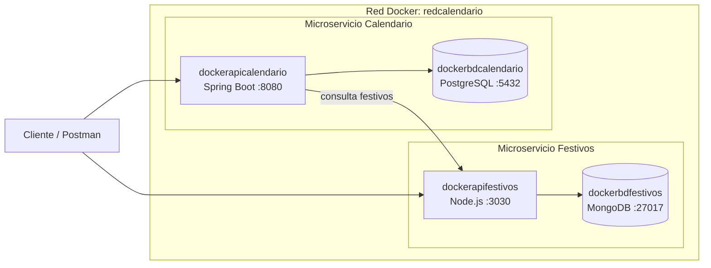

# Examen 2 – Orquestación y contenerización de microservicios

**Asignatura:** Software Empresarial 2026-2
**Institución:** Instituto Tecnológico Metropolitano (ITM)
**Docente:** Fray León Osorio Rivera
**Estudiante:** Andres Felipe Correa Ramirez

---

## 1. Descripción

Este proyecto orquesta con **Docker Compose** dos microservicios y sus bases de datos, que en el Examen 1 se levantaban manualmente con `docker run`:

| Microservicio | Tecnología | Base de datos |
|---|---|---|
| **ApiFestivos** | Node.js | MongoDB |
| **ApiCalendarioLaboral** | Java / Spring Boot | PostgreSQL |

ApiCalendarioLaboral consume a ApiFestivos para saber qué fechas del año son festivas y así generar el calendario laboral. Los cuatro contenedores se ejecutan en una misma red Docker llamada `redcalendario`, con un solo comando.

## 2. Arquitectura



| Contenedor | Imagen | Puerto | Función |
|---|---|---|---|
| `dockerbdfestivos` | `mongo` | 27017 | Base de datos de festivos |
| `dockerapifestivos` | construida desde el Dockerfile | 3030 | API de festivos |
| `dockerbdcalendario` | `postgres` | 5432 | Base de datos del calendario |
| `dockerapicalendario` | construida desde el Dockerfile | 8080 | API del calendario laboral |

Dentro de la red, los contenedores se encuentran por **nombre** (por ejemplo, `dockerbdfestivos` en `bd.config.js` y `dockerapifestivos` en `FestivoCliente.java`). Por eso los `container_name` del compose no deben cambiarse.

## 3. Estructura del repositorio

```
.
├── docker-compose.yml
├── .gitignore
├── README.md
├── mongo-init/
│   └── init-festivos.js              # Carga inicial de festivos en MongoDB
├── postgres-init/
│   └── 01-calendariolaboral.sql      # Tablas, índices y tipos en PostgreSQL
├── ITM_SE_Proyecto_apiFestivos-main/
│   ├── BD Mongo/
│   │   └── BDFestivos.mjs             # Script de base de datos del proyecto original
│   └── apifestivos/                   # Código + Dockerfile (Node.js)
└── ITM_SE_Proyecto_apiCalendarioLaboral-main/
    ├── BD/                            # Scripts SQL del proyecto original
    └── apicalendariolaboral/          # Código + Dockerfile (Spring Boot)
```

Los scripts de `mongo-init` y `postgres-init` se montan en `/docker-entrypoint-initdb.d`, por lo que se ejecutan **automáticamente la primera vez** que arranca cada base de datos. No es necesario cargar datos a mano.

## 4. Requisitos previos

- [Docker Desktop](https://www.docker.com/products/docker-desktop/) instalado y **en ejecución**
- Git
- Puertos libres en la máquina: `3030`, `8080`, `5432` y `27017`
  (si tienes PostgreSQL o MongoDB instalados localmente, detén esos servicios o cambia el puerto de la izquierda en el `docker-compose.yml`)

## 5. Cómo ejecutar

**1. Clonar el repositorio**

```bash
git clone https://github.com/af95correa-rgb/calendario-api.git
cd calendario-api
```

**2. Construir y levantar los contenedores**

```bash
docker compose up -d --build
```

La primera vez tarda unos minutos, ya que Maven descarga las dependencias y compila el proyecto Java.

**3. Verificar que todo está corriendo**

```bash
docker compose ps
```

Los cuatro contenedores deben aparecer en estado *running*, y las dos bases de datos en *healthy*.

## 6. Pruebas de funcionamiento

### 6.1 Endpoints

| Método | URL | Resultado esperado |
|---|---|---|
| GET | `http://localhost:3030/api/festivos/verificar/2023/6/12` | `{"Mensaje": "Es Festivo: Corpus Christi"}` |
| GET | `http://localhost:3030/api/festivos/obtener/2023` | Lista de festivos de 2023 |
| GET | `http://localhost:3030/api-docs` | Documentación interactiva de ApiFestivos |
| GET | `http://localhost:8080/api/calendario/generar/2023` | `true` |
| GET | `http://localhost:8080/api/calendario/listar/2023` | Los 365 días del 2023 con su tipo |

> Ejecutar `generar` antes de `listar`. Si la respuesta de `generar` es `true`, queda demostrado que ApiCalendarioLaboral se comunica con PostgreSQL y con ApiFestivos.

### 6.2 Datos cargados automáticamente

```bash
# MongoDB: debe responder 4
docker exec -it dockerbdfestivos mongosh festivos --eval "db.tipos.countDocuments()"

# PostgreSQL: debe mostrar 3 filas (Día laboral, Fin de Semana, Día festivo)
docker exec -it dockerbdcalendario psql -U postgres -d calendariolaboral -c "SELECT * FROM Tipo;"
```

### 6.3 Comunicación entre contenedores

```bash
docker exec -it dockerapicalendario sh
wget -qO- http://dockerapifestivos:3030/api/festivos/obtener/2023
exit
```

### 6.4 Contenedores dentro de la red

```bash
docker network inspect redcalendario --format "{{range .Containers}}{{.Name}}{{println}}{{end}}"
```

Debe listar los cuatro contenedores.

## 7. Comandos útiles

| Acción | Comando |
|---|---|
| Ver estado de los contenedores | `docker compose ps` |
| Ver logs de todo | `docker compose logs -f` |
| Ver logs de un servicio | `docker compose logs -f dockerapicalendario` |
| Detener y eliminar contenedores (conserva los datos) | `docker compose down` |
| Detener y eliminar contenedores **y datos** | `docker compose down -v` |
| Reconstruir tras cambiar código | `docker compose up -d --build` |

### Persistencia

Los datos se guardan en volúmenes de Docker (`mongo-data` y `postgres-data`), por lo que sobreviven a `docker compose down`. Los scripts de inicialización solo se ejecutan cuando el volumen está vacío; para volver a cargarlos desde cero se debe usar `docker compose down -v`.

## 8. Seguridad de credenciales

Para este ejercicio académico, la contraseña de prueba de PostgreSQL está definida directamente en `docker-compose.yml` y se pasa a ApiCalendarioLaboral mediante `SPRING_DATASOURCE_PASSWORD`. No se necesita crear un archivo `.env`.

> Esta configuración es solo para práctica y no debe reutilizarse en producción. Para un entorno real, usa variables de entorno o un gestor de secretos y evita subir credenciales al repositorio.

## 9. Solución de problemas

| Problema | Causa probable | Solución |
|---|---|---|
| `Cannot connect to the Docker daemon` | Docker Desktop no está abierto | Abrir Docker Desktop y esperar a que indique *Engine running* |
| `container name ... is already in use` | Quedan contenedores del Examen 1 | `docker rm -f dockerapicalendario dockerbdcalendario dockerapifestivos dockerbdfestivos` |
| `network redcalendario ... already exists` | Red creada manualmente antes | `docker network rm redcalendario` y volver a levantar |
| `port is already allocated` | Otro servicio usa ese puerto | Detener el servicio local o cambiar el puerto en el compose |
| La API de calendario se reinicia o falla al conectar | La base de datos aún no estaba lista o las credenciales no coinciden | Revisar `docker compose logs dockerapicalendario` y validar la configuración de PostgreSQL en `docker-compose.yml` |
| `generar` responde error | ApiFestivos no responde | Verificar `docker compose ps` y probar el endpoint de festivos |

## 10. Tecnologías

Docker · Docker Compose · Node.js 18 · Express · MongoDB · Java 17 · Spring Boot · Maven · PostgreSQL
